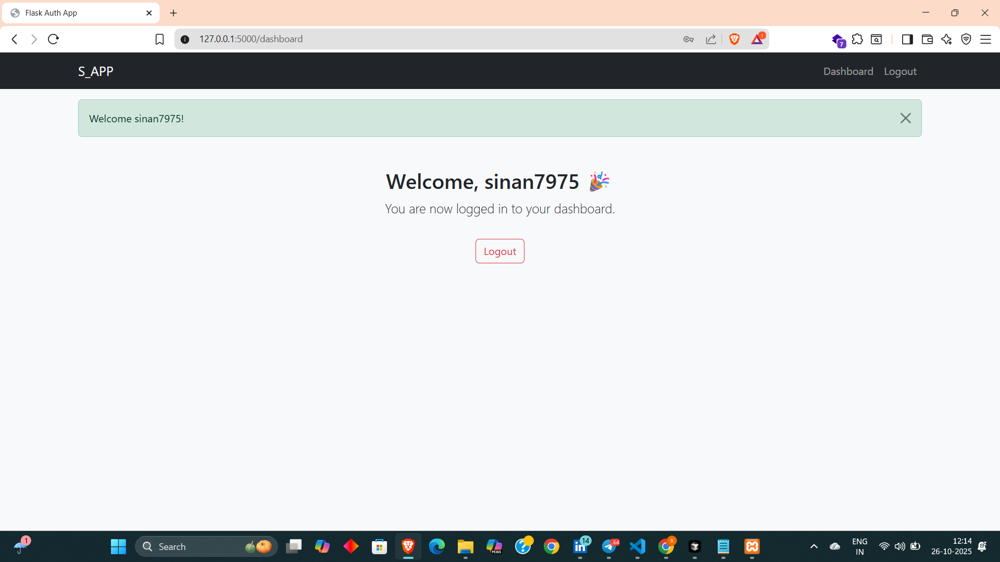

Great! I can help you create a polished `README.md` for your Flask project that includes images, descriptions, and a professional layout. Since you already have screenshots in the `screenshots/` folder, we can reference them directly. Here’s an example of a full `README.md` that will look good on GitHub:

```markdown
# Flask Login and Registration Portal

A secure web application for **User Registration, Login, Email Verification, and Password Reset** using **SQLite**, **Flask-Mail**, and **Flask-Bcrypt**.

---

## Features

- User registration with validation  
- Email verification using Flask-Mail  
- Secure password hashing with Flask-Bcrypt  
- Login and logout functionality with sessions  
- Password reset via email link  
- Rate limiting to prevent brute-force attacks  

---

## Setup Instructions

### 1. Install Dependencies
```bash
pip install flask flask_sqlalchemy flask_bcrypt flask_mail python-dotenv flask_limiter
````

### 2. Create a `.env` File

```
FLASK_SECRET_KEY=your_secret_key
DB_NAME=flaskdb
SMTP_EMAIL=your_email@gmail.com
SMTP_PASSWORD=your_email_app_password
SMTP_SERVER=smtp.gmail.com
SMTP_PORT=587
```

### 3. Run the Application

```bash
python run.py
```

Open your browser at `http://127.0.0.1:5000/`

---

## Screenshots

### 1. Homepage


### 2. Login with Wrong Password

(Shows error message “Invalid username or password.”)


### 3. Successful Login

(User redirected to dashboard)


### 4. Logout Screen

(User successfully logs out and returns to homepage)


### 5. Register with Existing Email

(Displays message “Username or email already exists.”)


---

## How It Works

1. Users register with username, email, and password.
2. Email verification is sent via Flask-Mail.
3. Verified users can log in and access the dashboard.
4. Password reset is available via secure email link.

---

## License

This project is open-source and free to use.

```

---

If you want, I can **also make it visually “GitHub ready” with clickable sections and badges** so it looks modern and professional.  

Do you want me to do that next?
```
